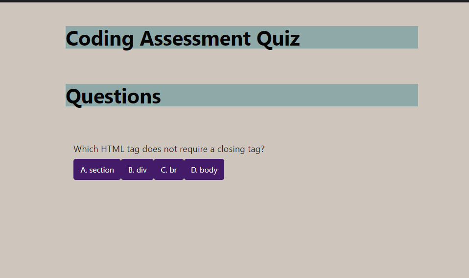

#coding-assessment-quiz

## Description

This is a basic five question coding assessment quiz, each correct answer earns 1 point, for a total of no more than 5 points.  

## Screenshot

![coding-assessment-quiz]  

## Link 

Live URL: https://phoenixpyra7.github.io/coding-assessment-quiz/ 

## Sources:  

Simple CSS https://simplecss.org/
